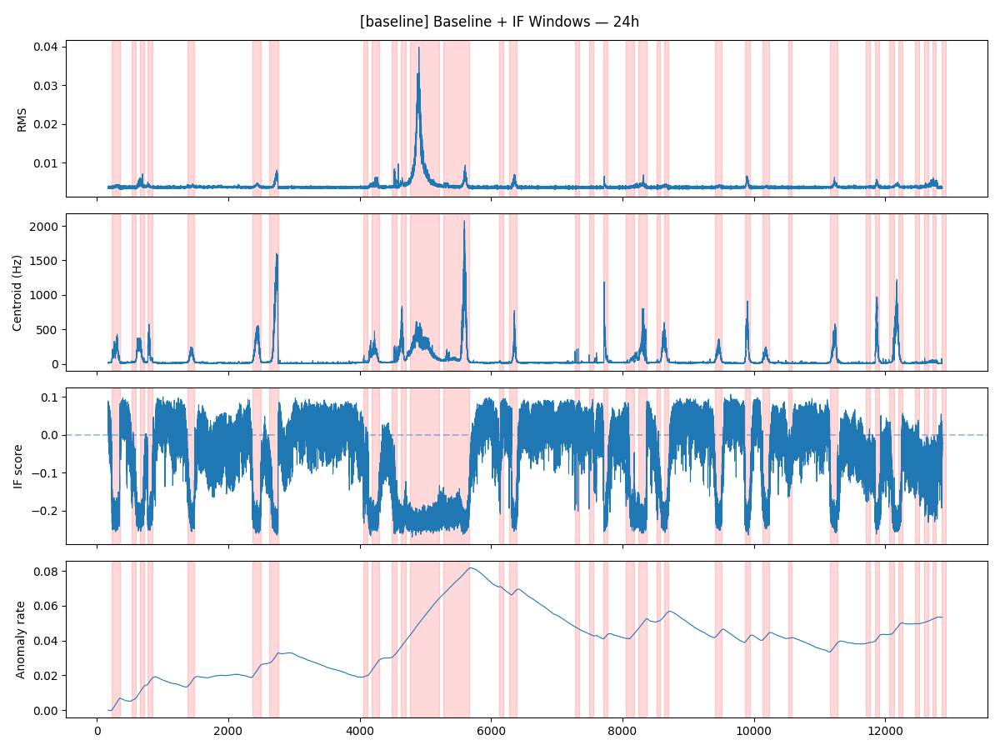
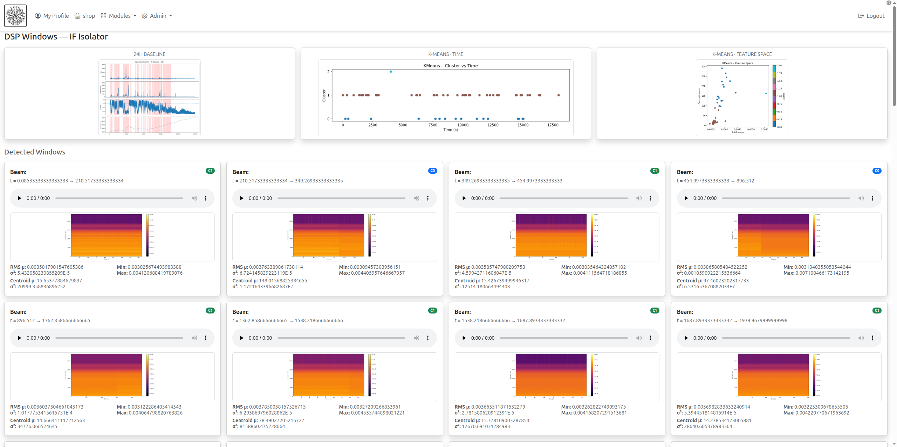
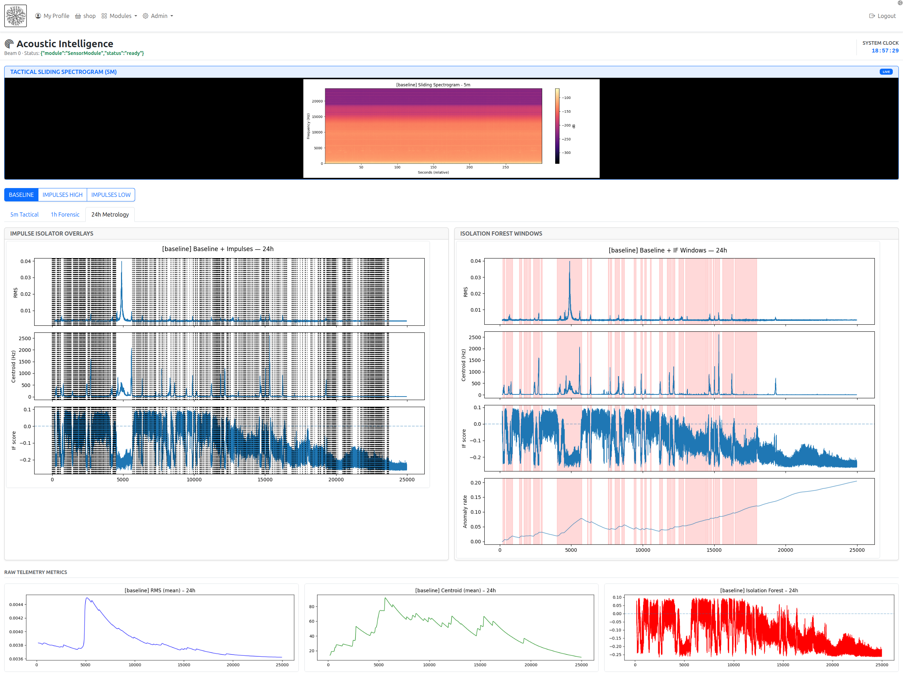

# thoughtframe-dsp  
**Reference DSP Application for the ThoughtFrame Python Runtime**

---

## Overview

`thoughtframe-dsp` is a **reference digital signal processing (DSP) application** built on top of the **ThoughtFrame Python Runtime**.

While this repository is positioned as a *reference app*, it is **architected to production quality**. The system is designed to run continuously, archive data safely, support offline reprocessing, and evolve without invalidating previously collected data.

It demonstrates how to build a real, long-running, domain-specific system using `thoughtframe-python`, rather than serving as a minimal or contrived example.

Primary use cases include:

- DIY towed hydrophone arrays
- Long-duration unattended acoustic recording
- Real-time signal monitoring
- Forensic, post-hoc signal analysis
- Experimental DSP and ML workflows

---

## What This Looks Like in Practice

### Long-Horizon DSP Segmentation (24h)



---

### Window Discovery and Regime Clustering



---

### Live ThoughtFrame UI (Tactical + Forensic Views)




## Relationship to ThoughtFrame Python Runtime

This project depends on:

> **ThoughtFrame Python Runtime**  
> The canonical Python-side runtime for ThoughtFrame systems.

`thoughtframe-dsp` shows how a Python application can:

- Register modules into a ThoughtFrame runtime
- Expose structured commands
- Run synchronous and asynchronous handlers
- Execute long-lived background processing
- Communicate over ThoughtFrame transports
- Operate under explicit lifecycle control

Unlike `thoughtframe-python`, which is **not an application**, this repository *is* a complete executable system.

---

## What This Repository Is

- A **reference DSP application**
- A **real working system**, not a toy demo
- A demonstration of proper ThoughtFrame usage
- Architected for continuous operation and replayability
- Intended to be read, modified, and extended

---

## What This Repository Is Not

- Not a reusable DSP framework
- Not a general-purpose ML platform
- Not a finished product
- Not a classification system
- Not opinionated about deployment or hardware

---

## DSP System Design (Start Here)

### Signal Model

Audio is processed as a stream of **fixed-size chunks**.

Each chunk is treated as part of an **ordered signal**, not as a timestamped event:

- `chunk_index` defines ordering
- `t_sec = chunk_index × (chunk_size / sample_rate)`
- No reliance on wall-clock time

This enables:

- Deterministic replay
- Identical live and offline behavior
- Robust long-duration operation
- Independence from clock drift

---

### High-Level Pipeline

[ Acquisition ]
    Audio Source

[ Spatialization ]
    Array Coordinator
    Virtual Beam Sensors

[ Per-Chunk DSP ]
    Acoustic Pipeline
    Chunk Processors

[ Temporal Modeling ]
    Temporal Context

[ Segmentation ]
    Window Isolators

[ Persistence ]
    Archived Audio, CSV, Events


Each stage is explicit, inspectable, and replaceable.

---

## Sources

Sources implement a simple interface that yields fixed-size audio chunks.

Examples include:
- `ffmpeg` (files or live devices)
- synthetic test sources

Sources perform **no DSP**. They only emit samples.

---

## Arrays and Beams

The **ArrayCoordinator** consumes one or more physical sensors and produces **virtual sensors** representing beams.

Key architectural decision:

> A beam is modeled as a sensor, not a filter.

As a result:
- Beams have IDs
- Beams have independent pipelines
- Beams can be archived and replayed independently

The demo currently uses a fan-out scaffold, but the abstraction supports real beamforming without refactoring. This is intentional groundwork for DIY towed arrays.

---

## Chunk-Level DSP

Chunk processors operate independently on each chunk.

Implemented examples include:
- RMS energy
- FFT-based spectral features
- Spectral centroid, bandwidth, rolloff, and flatness

FFT computation is lazy and cached per chunk.

All processors communicate through a per-chunk `analysis` object.

---

## Unsupervised Anomaly Detection

An **Isolation Forest** is trained online during an initial baseline period.

Properties:
- No labels
- No assumptions about source identity
- Produces a continuous anomaly score
- Designed to surface novelty, not classification

The output is intentionally weak until interpreted through temporal context.

---

## Temporal Context

Meaning emerges only after **temporal integration**.

The temporal context processor computes:
- Rolling RMS mean and variance
- Rolling spectral centroid mean
- Anomaly rate (time-integrated novelty)

This converts per-chunk noise into system-level behavior.

---

## Window Isolators (Segmentation, Not Classification)

The system does **not** label sounds.  
It segments the stream into **temporal regimes**.

All window isolators share a common base that handles:
- FSM state transitions
- Online statistics (Welford)
- CSV persistence
- HTTP event emission

### Implemented Isolators

- **Time Window Isolator**  
  Fixed-duration archival windows (e.g. 5 minutes)

- **Impulse Isolator**  
  Detects transient impulse density using TKEO and inter-click interval (ICI) statistics

- **Isolation Forest Window Isolator**  
  Segments phases based on anomaly-rate slope rather than magnitude thresholds

Windows are evidence containers, not detections.

---

## Archival and Replay

When a window closes, the system can persist:
- Raw audio (`.flac`)
- Aggregated DSP statistics (`.csv`)
- Structured window events
- Optional forensic plots

Nothing is destroyed.

Previously recorded audio can be:
- Reprocessed with new parameters
- Re-segmented with new logic
- Re-analyzed with new ML models

This is a core design goal.

---

## Live vs Offline Operation

### Live Mode
- Streams audio in real time
- Emits telemetry continuously
- Archives windows as they close

### Offline Mode
- Replays archived audio
- Uses identical pipelines
- Produces identical results

There are no special offline code paths.

---

## Forensics and Analysis Tools

The repository includes standalone scripts for:
- K-means clustering of windows
- DBSCAN regime discovery
- Feature-space visualization
- Time-ordered cluster inspection
- Inter-click interval forensics
- High-resolution spectrogram zooming

These tools assume exploratory, evidence-driven analysis.

---

## Intended Use Cases

- DIY towed hydrophone arrays
- Long-duration unattended recording
- Maritime acoustic research
- Signal discovery and exploration
- Teaching and experimentation
- Reference architecture for other domains

---

## Configuration Examples:

```json
{
  "sources": [
    {
      "id": "mic1",
      "type": "ffmpeg",
      "cmd": [
        "ffmpeg",
        "-i",
        "samples/OneDayHydrophone.flac",
        "-ac",
        "1",
        "-ar",
        "48000",
        "-f",
        "f32le",
        "-"
      ],
      "fs": 48000,
      "chunk_size": 4096
    }
  ],

  "arrays": [
    {
      "id": "towed_array",
      "inputs": ["mic1"],
      "geometry": {
        "spacing_m": 0.5,
        "sound_speed": 1500
      },
      "beams": [
        { "id": "beam_-30", "angle": -30 },
        { "id": "beam_0",   "angle": 0 },
        { "id": "beam_30",  "angle": 30 }
      ]
    }
  ],

  "sensors": [
    {
      "id": "beam_0",
      "type": "beam",
      "array": "towed_array",
      "pipeline": [
        {
          "op": "guard",
          "name": "baseline",
          "pipeline": [
            { "op": "debug" },
            { "op": "spectral_features" },
            { "op": "isolation_forest", "threshold": -0.1 },
            { "op": "temporal_context", "time": "1h" },
            {
              "op": "if_window_isolator",
              "threshold": -0.15,
              "min_duration": "1m"
            },
            {
              "op": "impulse_isolator",
              "threshold_mult": 10.0,
              "window_sec": 5.0,
              "min_impulses": 5
            },
            { "op": "telemetry" },
         {"op": "forensic_summary"},
         {
          "op": "ring_buffer",
          "seconds": 20
        }   
          ]
        }
        
      ]
    }
  ]
}
```


## Execution Model

Consistent with the ThoughtFrame Python Runtime:

- Nothing executes on import
- All wiring is explicit
- Startup and shutdown are host-controlled
- Lifecycle behavior is deterministic
- No hidden background processes

The application is safe to embed and reason about.

---

## Requirements

See `requirements.txt`.

Core dependencies include:
- NumPy / SciPy
- Librosa
- scikit-learn
- SoundFile
- FFmpeg
- Pandas
- Matplotlib

---

## Status

This repository is a **reference application**:
- Architected to production standards
- Optimized for correctness and clarity
- Designed for continuous operation
- Built to support long-term data value

It is meant to be read, extended, and adapted.

---

## ThoughtFrame Integration (UI, DAM, and Orchestration)

While `thoughtframe-dsp` can operate as a standalone DSP engine, it is designed to integrate directly with **ThoughtFrame**, where it becomes part of a much larger, stateful system.

In a full deployment, **ThoughtFrame provides the user interface, asset management, and finite state machine (FSM) orchestration** that sit above the DSP layer. This transforms the DSP pipeline from a signal processor into a **behavior-driving subsystem**.

---

### Role of ThoughtFrame

ThoughtFrame acts as the **host system** for `thoughtframe-dsp` and is responsible for:

- Launching and managing the Python runtime
- Routing structured commands to DSP modules
- Persisting and indexing DSP outputs as assets
- Providing a live and forensic user interface
- Orchestrating higher-level system behavior using FSMs

The DSP engine does not own lifecycle, UI, or global state.  
Those responsibilities belong explicitly to ThoughtFrame.

---

### DAM (Digital Asset Management)

All DSP outputs are treated as **first-class assets** inside ThoughtFrame:

- Raw audio recordings
- Windowed audio segments
- CSV telemetry
- Window metadata
- Generated forensic plots
- Derived analysis artifacts (clusters, labels, summaries)

This allows users to:

- Browse and replay audio windows
- Inspect DSP statistics alongside waveforms and spectrograms
- Compare multiple observers or pipelines
- Re-run offline analysis without recomputing raw DSP
- Treat signal evidence as durable, queryable data

DSP outputs are not ephemeral logs — they are managed artifacts.

---

### User Interface

ThoughtFrame provides a **web-based operational and forensic UI**, layered above the DSP system.

Typical UI capabilities include:

- Live tactical views (e.g. sliding spectrograms)
- Multi-horizon summaries (minutes, hours, days)
- Overlay of isolator decisions on raw telemetry
- Comparison of multiple observers or guards
- Interactive playback of detected windows
- Visualization of clustering and regime discovery

The UI is intentionally decoupled from DSP execution.  
It consumes persisted outputs rather than interfering with the signal path.

---

### FSM and Behavioral Orchestration

ThoughtFrame’s FSM layer allows DSP results to **drive system behavior**, not just visualization.

Examples of behaviors enabled by this integration:

- Triggering downstream workflows when certain window types appear
- Escalating system states based on anomaly persistence
- Switching DSP observers or parameters dynamically
- Coordinating multiple sensors or arrays
- Integrating DSP results with non-acoustic signals
- Driving alerts, recording policies, or mission phases

In this model, DSP does not “decide” actions.  
It emits structured evidence that feeds a higher-level state machine.

---

### Architectural Separation of Concerns

This separation is intentional and strict:

- **thoughtframe-dsp**
  - Signal processing
  - Feature extraction
  - Temporal modeling
  - Window segmentation
  - Evidence generation

- **ThoughtFrame**
  - Runtime orchestration
  - FSM logic
  - UI and visualization
  - Asset management
  - Cross-domain integration

This keeps the DSP layer:
- Deterministic
- Reproducible
- Testable
- Reusable in other domains

While allowing the overall system to scale into a full platform.

---

### From DSP Engine to Platform Component

When embedded in ThoughtFrame, `thoughtframe-dsp` becomes:

- A long-running sensing subsystem
- A producer of durable evidence
- An input into multi-stage workflows
- A component in a larger decision architecture

This is how the same DSP core can support:
- Simple DIY array experiments
- Operational monitoring systems
- Research platforms
- Multi-sensor, multi-modal environments

Without changing the DSP code itself.

---


## License

Apache License 2.0  
See `LICENSE` for details.
